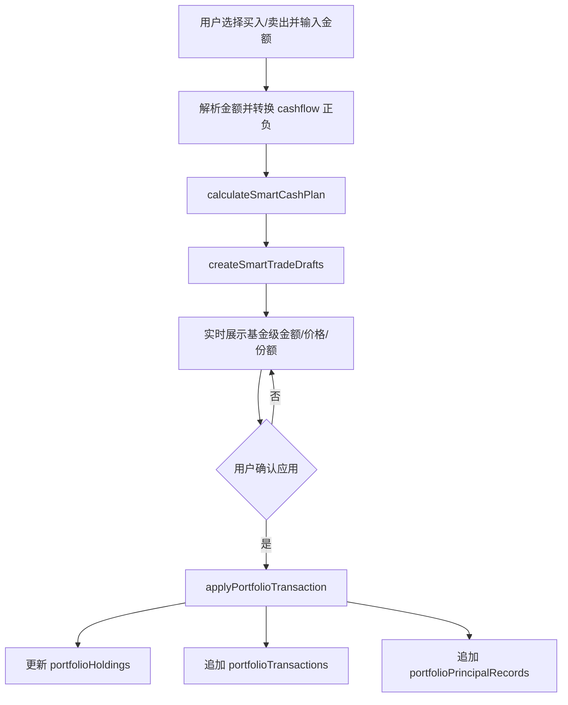

# 投资组合买卖界面改造设计文档

## 背景

当前投资组合模块已经具备目标比例、持仓、交易流水、再平衡建议和交易草稿能力，但买卖体验仍偏手工：

- 用户需要先选择资产类别或具体基金，再输入交易金额、份额和价格。
- 再平衡页虽然有现金流输入和智能买卖建议，但只显示到资产类别金额，没有把建议分配到每只基金。
- 交易草稿目前主要来自完整再平衡计划，而不是来自用户输入的“买入预算 / 卖出金额”。
- 支付宝等基金平台实际操作常以“份额”为单位，现有页面缺少按今日预估价格实时换算出的份额。

期望恢复旧 Excel 的核心体验：用户只输入一个数字，系统实时判断每项基金该不该买卖、买卖多少，并同时显示金额和份额。

## 目标

1. 买卖页以“输入金额”为主入口。
2. 输入买入预算或卖出金额后，实时计算每只基金的建议操作。
3. 保留旧智能买卖逻辑：根据输入金额是否超过阈值，自动选择平均买卖或填坑买卖。
4. 展示每只基金的建议买卖金额、参考价格、预估份额和计算依据。
5. 参考价格优先使用基估宝页面今日预估价格；没有预估价格时降级使用最新单位净值、持仓净值或成本价。
6. 用户确认后，一键生成并应用交易草稿，继续走现有交易引擎，保持持仓、本金记录和交易流水一致。

## 非目标

- 不在本次改造中开发自动下单或对接支付宝交易接口。
- 不改变现有投资组合、持仓、交易、本金记录的核心数据结构。
- 不移除高级手工交易入口；手工入口保留给分红、手续费、现金转入转出、历史补录等场景。
- 不把建议视为实际投资建议，页面文案应明确这是按组合目标比例生成的执行辅助。

## 当前代码基础

相关文件：

- `app/components/portfolio/PortfolioWorkspace.jsx`
  - 已有 `cashflowAmount`。
  - 已有 `smartCashPlan = calculateSmartCashPlan(...)`。
  - 再平衡 tab 中当前只展示资产类别级别的现金流建议。
  - 交易 tab 右侧仍是手工选择持仓、类型、金额、份额、价格的表单。
- `app/lib/portfolio/rebalance.js`
  - `calculateRebalancePlan(portfolio, holdings)`：计算每个资产类别偏离目标比例的金额。
  - `calculateSmartCashPlan(portfolio, holdings, cashflow)`：按输入现金流选择智能填坑/削峰或按比例买卖。
  - `createRebalanceTransactionDrafts(...)`：把完整再平衡建议转为交易草稿，但当前不是针对输入现金流的基金级草稿。
- `app/lib/portfolio/transactionEngine.js`
  - `applyPortfolioTransaction(...)` 已负责交易后更新持仓和本金记录。
- `app/lib/portfolio/holdingForm.js`
  - `normalizePortfolioFundCandidate(...)` 已把基金数据中的 `gsz/dwjz` 映射为 `estimatedNav/currentNav`。
- `app/api/fund.js`
  - `fetchFundData` 返回 `dwjz`、`gsz`、`gztime`、`jzrq` 等字段，可作为实时估值和份额换算来源。

## 推荐方案

推荐采用“现金流智能执行面板”方案：把现有再平衡页和交易页的核心买卖能力合并成一个以现金流为入口的执行面板。

用户流程：

1. 选择组合。
2. 在买卖区域选择方向：买入 / 卖出。
3. 输入一个金额：
   - 买入：表示本次新增买入预算。
   - 卖出：表示本次希望卖出的总金额。
4. 页面实时显示：
   - 本次采用的模式：按比例买卖 / 填坑买入 / 削峰卖出。
   - 每只基金建议买卖金额。
   - 参考价格来源和价格。
   - 预估份额。
   - 交易后该基金持仓、市值、资产类别比例的预估变化。
5. 用户点击“生成交易草稿”或“应用买卖草稿”。
6. 系统调用现有交易引擎写入交易流水，并更新持仓与本金记录。

这种方案最贴近旧 Excel 的操作模型，同时复用当前组合模块已有的目标比例、再平衡和交易引擎。

## 备选方案

### 方案 A：只增强当前再平衡页

在再平衡 tab 的现金流输入下方增加基金级明细和份额换算。

优点：

- 改动最小。
- 复用当前 tab 和 `cashflowAmount`。

缺点：

- 买卖入口仍藏在“再平衡”概念下，用户理解成本较高。
- 手工交易表单仍在交易 tab，两个入口容易割裂。

### 方案 B：新增独立“智能买卖”tab

在组合详情 tab 中新增“买卖”或“智能买卖”，只承载现金流输入、实时建议、份额预估和草稿应用。

优点：

- 用户心智最清晰。
- 可以把手工交易保留在“交易”tab，把智能执行独立出来。
- 后续扩展费率、最小买入金额、卖出份额限制更自然。

缺点：

- 需要新增 tab、样式和面板组件。

### 方案 C：改造交易 tab 为双模式

交易 tab 顶部放“智能买卖 / 手工记录”分段按钮。

优点：

- 不新增顶层 tab。
- 交易流水和交易动作在同一页。

缺点：

- 交易页信息密度会变高。
- 智能买卖的实时表格可能挤压交易历史空间。

建议选择方案 B：新增独立“智能买卖”tab。它最符合“只输入一样东西”的目标，也能降低手工交易表单对主要流程的干扰。

## 核心计算设计

### 1. 输入模型

新增智能交易输入状态：

```js
{
  direction: 'buy' | 'sell',
  amount: '',
  date: today(),
  feeMode: 'ignore' | 'rate' | 'fixed',
  feeRate: '',
  feeAmount: '',
}
```

第一版可以先忽略手续费，保持金额和份额清晰；后续再补费率和最小金额。

### 2. 金额正负约定

- 买入输入 `amount = 10000`，传给计算层为 `cashflow = 10000`。
- 卖出输入 `amount = 10000`，传给计算层为 `cashflow = -10000`。
- UI 中不要要求用户输入负数。

### 3. 智能模式判断

沿用当前 `calculateSmartCashPlan` 的判断：

- 如果 `abs(cashflow) > rebalance.thresholdAmount` 且阈值金额大于 0：使用 `proportional`，按目标比例分配到资产类别。
- 否则：
  - 买入：使用 `smart_fill`，优先买入低于目标比例、缺口最大的资产类别。
  - 卖出：使用 `smart_trim`，优先卖出高于目标比例、超配最大的资产类别。

需要在 UI 中把模式翻译成中文：

- `proportional`：按比例买卖
- `smart_fill`：填坑买入
- `smart_trim`：削峰卖出

### 4. 从资产类别分配到基金

新增纯函数 `createSmartTradeDrafts`，位置建议放在 `app/lib/portfolio/rebalance.js`：

```js
createSmartTradeDrafts({
  portfolio,
  holdings,
  plan,
  date,
  priceByFundCode,
})
```

输入：

- `plan` 来自 `calculateSmartCashPlan`。
- `holdings` 为当前组合全部持仓。
- `priceByFundCode` 来自基估宝实时基金列表或持仓已有价格。

输出：

```js
{
  mode,
  totalCashflow,
  rows: [
    {
      id,
      portfolioId,
      holdingId,
      assetClassId,
      assetClassName,
      fundCode,
      fundName,
      type: 'buy' | 'sell' | 'cash_in' | 'cash_out',
      amount,
      price,
      priceSource,
      share,
      currentShare,
      currentValue,
      projectedShare,
      projectedValue,
      warning,
    }
  ],
  warnings: []
}
```

第一版基金级分配规则建议保守处理：

- 每个资产类别如果只有一个可交易基金，全部金额分配给该基金。
- 如果一个资产类别有多个基金：
  - 买入时优先分配给该类别内相对低配的基金；若缺少基金级目标比例，则按当前市值反向补齐，空仓或市值最小者优先。
  - 卖出时优先从该类别内市值最大的基金卖出，且不能超过其可卖市值或份额。
- 现金类持仓生成 `cash_in` / `cash_out`，份额为 0，价格为 0。
- 手动资产没有价格时只显示金额，不生成份额；需要在行内标注“缺少价格，需手工确认”。

### 5. 价格和份额计算

价格优先级：

1. 基估宝今日预估价格：`fund.gsz` 或 `normalizePortfolioFundCandidate(...).estimatedNav`。
2. 最新单位净值：`fund.dwjz` 或 `currentNav`。
3. 持仓已有 `estimatedNav`。
4. 持仓已有 `currentNav`。
5. 持仓 `costPrice`。

份额计算：

```js
share = amount / price
```

精度：

- 金额保留 2 位。
- 价格保留 4 到 6 位。
- 份额保留 2 到 6 位，内部数据保持 6 位。

卖出限制：

- `sellShare <= holding.share`。
- 如果卖出金额按价格换算后超过可卖份额，行内显示“已按最大可卖份额截断”，金额同步调整为 `holding.share * price`。
- 如果总卖出金额大于当前可卖市值，显示总警告，不允许一键应用。

## UI 设计建议

新增 `智能买卖` tab，布局如下：

1. 顶部输入区：
   - 买入 / 卖出分段按钮。
   - 金额输入框。
   - 日期选择，默认今天。
   - 小提示：价格使用今日预估净值，实际成交以平台确认为准。

2. 策略摘要：
   - 本次模式：按比例买卖 / 填坑买入 / 削峰卖出。
   - 输入金额。
   - 可执行金额。
   - 无法执行金额或警告数。

3. 建议表格：
   - 操作：买入 / 卖出
   - 基金：代码 + 名称
   - 资产类别
   - 金额
   - 参考价格
   - 预估份额
   - 价格来源
   - 状态 / 警告

4. 操作区：
   - “生成交易草稿”或“应用买卖草稿”
   - “复制操作清单”
   - “清空金额”

移动端表格应折叠为每只基金一张紧凑卡片，重点显示基金名、操作方向、金额、份额和价格。

## 数据流



## 实现路径

### 第 1 步：补纯计算函数

在 `app/lib/portfolio/rebalance.js` 中新增：

- `resolveHoldingTradePrice(holding, fundCandidate)`
- `splitCashPlanToHoldings({ portfolio, holdings, plan, funds })`
- `createSmartTradeDrafts(...)`

要求：

- 不依赖 React。
- 输入输出可直接被 smoke test 覆盖。
- 输出同时包含金额、价格、份额、警告。

### 第 2 步：补测试脚本

新增或扩展 `scripts/portfolio-transaction-smoke-test.mjs`：

- 买入金额低于阈值时，优先填坑。
- 买入金额高于阈值时，按目标比例分配。
- 卖出金额低于阈值时，优先削峰。
- 卖出金额超过可卖市值时，输出阻断警告。
- 使用 `gsz` 计算份额，缺失时降级到 `dwjz/currentNav/costPrice`。

### 第 3 步：新增智能买卖面板组件

建议新增文件：

- `app/components/portfolio/PortfolioSmartTradePanel.jsx`

职责：

- 接收 `portfolio`、`holdings`、`funds`、`onApplyDrafts`。
- 管理方向、金额、日期等 UI 状态。
- 调用纯函数生成实时建议。
- 渲染摘要、表格、警告和应用按钮。

### 第 4 步：接入 `PortfolioWorkspace`

修改 `app/components/portfolio/PortfolioWorkspace.jsx`：

- `detailTabs` 增加 `{ id: 'smartTrade', label: '智能买卖' }`。
- 在主内容区渲染 `PortfolioSmartTradePanel`。
- 复用已有 `applyTransactionDrafts`。
- 手工交易表单继续保留在 `transactions` tab，作为高级入口。

### 第 5 步：价格数据接入

优先从 `funds` 传入的实时基金列表中按 `fundCode` 查找：

- `gsz` -> 今日预估价格。
- `dwjz` -> 最新单位净值。
- `gztime/jzrq` -> 价格时间说明。

如果持仓的 `fundCode` 不在实时列表中：

- 使用持仓已有 `estimatedNav/currentNav/costPrice`。
- 行内显示价格来源为“持仓价格”或“成本价”。

### 第 6 步：应用交易草稿

应用前校验：

- 金额必须大于 0。
- 至少有一条可执行草稿。
- 不存在阻断级警告。
- 卖出份额不得超过当前持有份额。

应用时：

- 买入草稿使用 `type: 'buy'`。
- 卖出草稿使用 `type: 'sell'`。
- 现金类使用 `cash_in/cash_out`。
- `amount`、`share`、`price` 写入交易。
- `note` 写入模式说明，例如 `智能买卖: 填坑买入`。

### 第 7 步：界面文案和可用性

需要补齐中文文案：

- 输入框 placeholder：`输入本次买入预算` / `输入本次卖出金额`
- 空状态：`输入金额后自动生成每只基金的买卖金额和份额`
- 价格提示：`份额按今日预估净值测算，实际成交以基金平台确认为准`
- 阻断提示：`卖出金额超过当前可卖市值，请降低金额`

### 第 8 步：验证

运行：

```bash
npm run lint
node scripts/portfolio-transaction-smoke-test.mjs
npm run build
```

如果后续实际改 UI，还需要用浏览器验证：

- 桌面端智能买卖 tab 表格不溢出。
- 移动端卡片可读，金额和份额不换行错乱。
- 输入金额时建议实时更新。
- 应用草稿后交易流水和持仓同步变化。

## 风险和处理

- 预估价格不是最终成交价：页面必须标注“预估”，交易记录可保留用户确认时的参考价。
- 多基金同一资产类别的分配规则可能和用户主观偏好不同：第一版先保守按市值缺口/市值大小处理，后续可加基金级目标权重。
- 卖出受平台可卖份额、确认中份额、持有期费率影响：第一版只按当前持仓份额限制，后续再接入待确认交易和费率规则。
- 当前部分源码中文显示存在编码异常：改造时应避免无关大范围重写，优先新增组件和纯函数，减少触碰乱码区域。

## 验收标准

- 用户在智能买卖页只需输入一个金额，即可看到每只基金的买卖金额和份额。
- 修改金额时，结果实时更新，无需点击计算。
- 买入和卖出都能自动判断按比例还是填坑/削峰。
- 基金份额优先使用基估宝今日预估价格计算。
- 缺少价格或卖出超额时有明确提示，不产生错误交易。
- 一键应用后，交易流水、持仓份额、本金记录保持一致。
- 原手工交易能力仍可使用。
